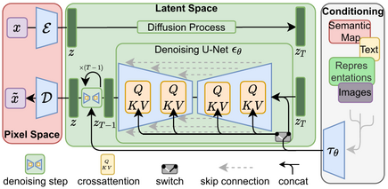

# Latent Diffusion for Pose-Conditioned Person Generation

Environment Setup:

    conda env create -f environment.yaml
    conda activate GeoDiffPose
    pip install torchmetrics==0.6.0

This repository contains a latent diffusion workflow with pose conditioning extensions for SLP-style keypoints.

## Paper

This codebase is related to the paper: XXX (add your paper URL here).

Suggested format after you add the link:

[Geometry-Conditioned Diffusion for Occlusion-Robust In-Bed Pose Estimation](https://arxiv.org/abs/2604.23651)

## What Is Implemented

The repository includes standard latent diffusion components plus multiple pose conditioning variants for controlled generation.

Key idea: generate an image from latent noise while conditioning on keypoint information.

## Conditioning Approaches

The project explores conditioning along three axes.

1. Keypoint representation
- Full keypoints: 39 values (13 x, y, v triplets)
- XY-only keypoints: 26 values (13 x, y pairs)

2. Conditioning encoder
- No MLP: direct/identity-style mapping of pose vector to conditioning tensor
- MLP: learned pose projection before injection into the diffusion model

3. Injection mechanism
- Concat conditioning: pose feature maps are spatially expanded and concatenated in the UNet path
- Cross-attention conditioning: pose embedding is transformed to token/context form and consumed by attention blocks

## Variant Scripts

Pose sampler scripts are located in scripts/pose_sampler.

- slp_sampler_kpts_full_no_mlp_concat.py
- slp_sampler_kpts_full_mlp_concat.py
- slp_sampler_kpts_full_mlp_crossattn.py
- slp_sampler_kpts_xy_no_mlp_concat.py
- slp_sampler_kpts_xy_mlp_concat.py
- slp_sampler_kpts_xy_mlp_crossattn.py

## Repository Structure (Relevant Parts)

- main.py: training entry point (PyTorch Lightning)
- ldm/: diffusion model, modules, and data utilities
- configs/latent-diffusion/: model and experiment configs
- scripts/pose_sampler/: inference scripts for each conditioning variant
- data/slp-conditional/: expected dataset root for conditional training/sampling

## Environment Setup

1. Create and activate environment

    conda env create -f environment.yaml
    conda activate GeoDiffPose

2. Install local package

    pip install -e .

## Data Layout (SLP Conditional)

Expected structure under data/slp-conditional:

- train.txt, val.txt
- labels/
- target/ (or target_2 which indicate the cover type)

The txt split files should list relative image paths used to locate both image targets and matching keypoint label files.

## Data Preparation

Prepare the dataset under data/slp-conditional with the following structure and meaning:

- labels: keypoint annotation files
- target: cover 1 type images
- target_2: cover 2 type images
- train.txt: samples included in training
- val.txt: samples included in validation

## Training

General training command:

    python main.py -t True --base <CONFIG_YAML> --name <RUN_NAME>

Example (edit config as needed):

    python main.py -t True --base configs/latent-diffusion/slp_kpts_full_mlp_crossattn_config.yaml --name slp_kpts_full_mlp_crossattn

## Sampling

General sampler pattern:

    PYTHONPATH=$PWD python scripts/pose_sampler/<SAMPLER_SCRIPT>.py --config <CONFIG_YAML> --ckpt <CHECKPOINT> --outdir <OUTPUT_DIR> --val-txt data/slp-conditional/val.txt --data-root data/slp-conditional

Example (XY + MLP + concat):

    PYTHONPATH=$PWD python scripts/pose_sampler/slp_sampler_kpts_xy_mlp_concat.py --config <CONFIG_YAML> --ckpt <CHECKPOINT> --outdir outputs/slp_xy_mlp_concat_samples --val-txt data/slp-conditional/val.txt --data-root data/slp-conditional --target-dir target --label-dir labels --num-variations 1 --ddim-steps 100 --scale 1.0 --ddim-eta 1.0 --image-size 256 --num-workers 1

## Notes and Troubleshooting

- Cross-attention variants expect context-shaped conditioning, while concat variants expect spatially broadcast conditioning.
- Some scripts default to target and others to target_2. Match script arguments to your dataset folders.

## Acknowledgment

This repository builds on latent diffusion tooling and includes project-specific conditioning and data handling extensions.
